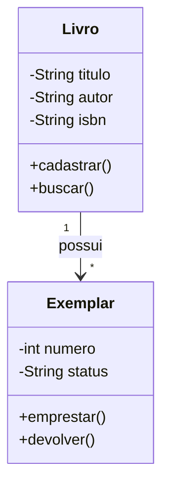

<<<<<<< HEAD
[](https://classroom.github.com/a/Fm17FUy0)
[](https://classroom.github.com/open-in-codespaces?assignment_repo_id=23442218)
# PRÁTICA AVALIADA 2 - ES1 (10 pontos)

**Módulo/Semana:** 7  
**Conteúdo avaliado:** Módulos 4, 5 e 6 (Unidades 4, 5, 6 e 7)  
**Duração sugerida:** 2 horas  
**Tipo:** Prática integradora avaliativa

---

## CONTEXTUALIZAÇÃO

A **"BiblioTech"** é uma startup que está desenvolvendo um sistema de gestão para bibliotecas comunitárias. O sistema deve permitir que bibliotecas gerenciem seu acervo, controlem empréstimos e reservas, e mantenham um cadastro de leitores.

Você foi contratado como **Engenheiro de Software** para:
1. Levantar e documentar requisitos usando técnicas apropriadas
2. Modelar o sistema usando UML
3. Garantir que o design do código siga princípios sólidos de engenharia de software

---

## QUESTÃO 1: Engenharia de Requisitos (3,5 pontos)

### Contexto

O cliente da BiblioTech forneceu a seguinte descrição inicial:

> "Precisamos de um sistema onde bibliotecários possam cadastrar livros no acervo (título, autor, ISBN, categoria, quantidade de exemplares). Os leitores devem se cadastrar informando nome, CPF, email e telefone. Quando um leitor quiser um livro, o bibliotecário registra o empréstimo (data de empréstimo e data prevista de devolução em 14 dias). Se todos os exemplares estiverem emprestados, o leitor pode fazer uma reserva. Quando o livro for devolvido, o primeiro leitor da fila de reservas é notificado por email. O sistema também deve permitir renovar empréstimos (desde que não haja reservas) e aplicar multas por atraso (R$ 2,00 por dia)."

### Enunciado

**a) (2,0 pontos)** Crie um arquivo `requisitos.md` contendo:

1. **Requisitos Funcionais** (RF) - liste pelo menos 10 requisitos funcionais identificados na descrição
2. **Requisitos Não-Funcionais** (RNF) - proponha pelo menos 5 requisitos não-funcionais relevantes (desempenho, segurança, usabilidade, etc.)
3. **Regras de Negócio** (RN) - identifique pelo menos 5 regras de negócio

**Formato esperado:**

```markdown
## Requisitos Funcionais

| ID | Descrição | Prioridade |
|----|-----------|------------|
| RF01 | O sistema deve permitir... | Alta |
...

## Requisitos Não-Funcionais

| ID | Categoria | Descrição | Métrica |
|----|-----------|-----------|---------|
| RNF01 | Desempenho | O sistema deve... | ... |
...

## Regras de Negócio

| ID | Descrição |
|----|-----------|
| RN01 | O prazo padrão de empréstimo é de 14 dias |
...
```

**b) (1,5 pontos)** No mesmo arquivo, crie **6 User Stories** seguindo o critério INVEST e o formato:

```
Como [papel]
Quero [ação]
Para [benefício]

Critérios de Aceitação:
- [ ] ...
- [ ] ...

Story Points: X
```

As user stories devem cobrir diferentes funcionalidades do sistema.

### Critérios de Avaliação

| Critério | Pontuação |
|----------|-----------|
| Identificação completa e correta de 10 RF | 0,8 |
| Proposição adequada de 5 RNF com métricas | 0,6 |
| Identificação correta de 5 RN | 0,6 |
| 6 User Stories bem estruturadas e em formato correto | 0,6 |
| User Stories atendem critério INVEST | 0,5 |
| Critérios de aceitação claros e testáveis | 0,4 |

---

## QUESTÃO 2: Modelagem UML (3,5 pontos)

### Contexto

Agora você precisa modelar o sistema BiblioTech usando diagramas UML para comunicar a estrutura e comportamento do sistema.

### Enunciado

Crie um arquivo `modelagem-uml.md` contendo os seguintes diagramas usando **Mermaid**:

**a) (1,5 pontos) Diagrama de Classes**

Modele as principais classes do sistema com:
- Classes: `Livro`, `Exemplar`, `Leitor`, `Emprestimo`, `Reserva`, `Bibliotecario`, `Multa`
- Atributos relevantes de cada classe
- Relacionamentos com cardinalidades corretas
- Pelo menos 2 métodos principais por classe

**b) (1,0 ponto) Diagrama de Sequência**

Modele a interação para o cenário: **"Realizar empréstimo de um livro"**

Deve incluir:
- Atores: Bibliotecário
- Objetos: Sistema, Livro, Leitor, Emprestimo
- Verificações: disponibilidade do livro, situação do leitor
- Registro do empréstimo

**c) (1,0 ponto) Diagrama de Atividades**

Modele o fluxo completo de: **"Devolver livro e processar reservas"**

Deve incluir:
- Registro da devolução
- Cálculo de multa (se houver atraso)
- Verificação de reservas
- Notificação do próximo leitor (se houver reserva)
- Estados finais: com/sem multa, com/sem notificação

### Exemplo de Formato Mermaid para Diagrama de Classes:



### Critérios de Avaliação

| Critério | Pontuação |
|----------|-----------|
| Diagrama de Classes completo e correto | 0,7 |
| Relacionamentos e cardinalidades adequados | 0,4 |
| Atributos e métodos relevantes | 0,4 |
| Diagrama de Sequência mostra fluxo correto | 0,5 |
| Mensagens e ativações adequadas no diagrama de sequência | 0,5 |
| Diagrama de Atividades com decisões e fluxos corretos | 0,6 |
| Sintaxe Mermaid correta e diagramas renderizáveis | 0,4 |

---

## QUESTÃO 3: Princípios de Design e SOLID (3,0 pontos)

### Contexto

O time de desenvolvimento inicial criou uma primeira versão da classe responsável por gerenciar empréstimos, mas ela viola vários princípios de design. O código está funcional e conectado a um banco de dados SQLite real.

### Banco de Dados Fornecido

O arquivo `biblioteca.db` (SQLite) já está configurado com o seguinte esquema:

```sql
CREATE TABLE livros (
    isbn TEXT PRIMARY KEY,
    titulo TEXT NOT NULL,
    autor TEXT NOT NULL,
    categoria TEXT,
    exemplares_disponiveis INTEGER DEFAULT 0
);

CREATE TABLE leitores (
    cpf TEXT PRIMARY KEY,
    nome TEXT NOT NULL,
    email TEXT NOT NULL,
    telefone TEXT
);

CREATE TABLE emprestimos (
    id INTEGER PRIMARY KEY AUTOINCREMENT,
    livro_isbn TEXT NOT NULL,
    leitor_cpf TEXT NOT NULL,
    data_emprestimo TEXT NOT NULL,
    data_devolucao_prevista TEXT NOT NULL,
    data_devolucao TEXT,
    FOREIGN KEY (livro_isbn) REFERENCES livros(isbn),
    FOREIGN KEY (leitor_cpf) REFERENCES leitores(cpf)
);

CREATE TABLE multas (
    id INTEGER PRIMARY KEY AUTOINCREMENT,
    emprestimo_id INTEGER NOT NULL,
    valor REAL NOT NULL,
    paga INTEGER DEFAULT 0,
    FOREIGN KEY (emprestimo_id) REFERENCES emprestimos(id)
);

CREATE TABLE reservas (
    id INTEGER PRIMARY KEY AUTOINCREMENT,
    livro_isbn TEXT NOT NULL,
    leitor_cpf TEXT NOT NULL,
    data_reserva TEXT NOT NULL,
    FOREIGN KEY (livro_isbn) REFERENCES livros(isbn),
    FOREIGN KEY (leitor_cpf) REFERENCES leitores(cpf)
);
```

O banco já contém dados de exemplo para testes.

### Enunciado

**a) (1,0 ponto)** Analise o código Python abaixo (arquivo `src/gerenciador_original.py` fornecido) e, no arquivo `analise-design.md`, identifique:
- Quais princípios SOLID estão sendo violados
- Quais problemas de coesão e acoplamento existem
- Sugestões específicas de refatoração

### Código Fornecido: `src/gerenciador_original.py`

```python
import sqlite3
import smtplib
from email.mime.text import MIMEText
from datetime import datetime, timedelta
from reportlab.pdfgen import canvas

class GerenciadorEmprestimo:
    def __init__(self, db_path='biblioteca.db'):
        self.db_path = db_path
    
    def conectar_banco(self):
        """Conecta ao banco de dados SQLite"""
        return sqlite3.connect(self.db_path)
    
    def realizar_emprestimo(self, livro_isbn, leitor_cpf):
        """Realiza empréstimo de um livro"""
        conn = self.conectar_banco()
        cursor = conn.cursor()
        
        # Busca livro
        cursor.execute("SELECT * FROM livros WHERE isbn = ?", (livro_isbn,))
        livro = cursor.fetchone()
        
        if not livro:
            conn.close()
            return False, "Livro não encontrado"
        
        # Busca leitor
        cursor.execute("SELECT * FROM leitores WHERE cpf = ?", (leitor_cpf,))
        leitor = cursor.fetchone()
        
        if not leitor:
            conn.close()
            return False, "Leitor não encontrado"
        
        # Verifica disponibilidade
        exemplares_disponiveis = livro[4]  # Índice da coluna exemplares_disponiveis
        
        if exemplares_disponiveis > 0:
            # Registra empréstimo
            data_emprestimo = datetime.now().strftime('%Y-%m-%d')
            data_devolucao = (datetime.now() + timedelta(days=14)).strftime('%Y-%m-%d')
            
            cursor.execute("""
                INSERT INTO emprestimos (livro_isbn, leitor_cpf, data_emprestimo, data_devolucao_prevista)
                VALUES (?, ?, ?, ?)
            """, (livro_isbn, leitor_cpf, data_emprestimo, data_devolucao))
            
            # Atualiza disponibilidade
            cursor.execute("""
                UPDATE livros 
                SET exemplares_disponiveis = exemplares_disponiveis - 1 
                WHERE isbn = ?
            """, (livro_isbn,))
            
            conn.commit()
            emprestimo_id = cursor.lastrowid
            
            # Envia email
            try:
                msg = MIMEText(f"Empréstimo realizado: {livro[1]}")
                msg['Subject'] = 'Empréstimo Realizado'
                msg['To'] = leitor[2]  # email do leitor
                
                server = smtplib.SMTP('smtp.gmail.com', 587)
                server.starttls()
                server.login('biblioteca@exemplo.com', 'senha')
                server.send_message(msg)
                server.quit()
            except:
                pass  # Ignora erro de email
            
            # Gera PDF
            try:
                c = canvas.Canvas(f'comprovante_{emprestimo_id}.pdf')
                c.drawString(100, 750, f'Empréstimo #{emprestimo_id}')
                c.drawString(100, 730, f'Livro: {livro[1]}')
                c.drawString(100, 710, f'Leitor: {leitor[1]}')
                c.drawString(100, 690, f'Devolução: {data_devolucao}')
                c.save()
            except:
                pass  # Ignora erro de PDF
            
            conn.close()
            return True, "Empréstimo realizado com sucesso"
        else:
            # Cria reserva
            data_reserva = datetime.now().strftime('%Y-%m-%d')
            cursor.execute("""
                INSERT INTO reservas (livro_isbn, leitor_cpf, data_reserva)
                VALUES (?, ?, ?)
            """, (livro_isbn, leitor_cpf, data_reserva))
            
            conn.commit()
            conn.close()
            return False, "Livro indisponível. Reserva criada."
    
    def calcular_multa(self, emprestimo_id):
        """Calcula multa por atraso"""
        conn = self.conectar_banco()
        cursor = conn.cursor()
        
        cursor.execute("SELECT * FROM emprestimos WHERE id = ?", (emprestimo_id,))
        emprestimo = cursor.fetchone()
        
        if not emprestimo:
            conn.close()
            return 0
        
        data_devolucao_prevista = datetime.strptime(emprestimo[4], '%Y-%m-%d')
        
        if datetime.now() > data_devolucao_prevista:
            dias_atraso = (datetime.now() - data_devolucao_prevista).days
            multa = dias_atraso * 2.0
            
            # Salva multa
            cursor.execute("""
                INSERT INTO multas (emprestimo_id, valor)
                VALUES (?, ?)
            """, (emprestimo_id, multa))
            
            conn.commit()
            
            # Busca leitor para notificar
            leitor_cpf = emprestimo[2]
            cursor.execute("SELECT * FROM leitores WHERE cpf = ?", (leitor_cpf,))
            leitor = cursor.fetchone()
            
            # Envia email de multa
            try:
                msg = MIMEText(f"Multa de R$ {multa:.2f} aplicada")
                msg['Subject'] = 'Multa por Atraso'
                msg['To'] = leitor[2]
                
                server = smtplib.SMTP('smtp.gmail.com', 587)
                server.starttls()
                server.login('biblioteca@exemplo.com', 'senha')
                server.send_message(msg)
                server.quit()
            except:
                pass
            
            conn.close()
            return multa
        
        conn.close()
        return 0
```

**b) (2,0 pontos)** Refatore o código no arquivo `src/emprestimo_refatorado.py` aplicando:
- **SRP (Single Responsibility Principle)**: Separe responsabilidades em classes distintas
- **OCP (Open/Closed Principle)**: Use abstração para extensibilidade
- **DIP (Dependency Inversion Principle)**: Use injeção de dependências
- **Baixo Acoplamento e Alta Coesão**

Crie as seguintes classes com responsabilidades únicas:

```python
# Interface para repositórios
from abc import ABC, abstractmethod

class IRepositorio(ABC):
    """Interface para operações de persistência"""
    @abstractmethod
    def buscar(self, id):
        pass
    
    @abstractmethod
    def salvar(self, entidade):
        pass

# Repositórios específicos
class RepositorioLivro(IRepositorio):
    """Responsável apenas por operações com livros no BD"""
    pass

class RepositorioLeitor(IRepositorio):
    """Responsável apenas por operações com leitores no BD"""
    pass

class RepositorioEmprestimo(IRepositorio):
    """Responsável apenas por operações com empréstimos no BD"""
    pass

# Serviços
class ServicoNotificacao:
    """Responsável apenas por enviar notificações"""
    pass

class ServicoRelatorio:
    """Responsável apenas por gerar relatórios"""
    pass

class CalculadoraMulta:
    """Responsável apenas por calcular multas"""
    pass

# Classe principal refatorada
class GerenciadorEmprestimo:
    """Orquestra o processo de empréstimo usando os serviços"""
    def __init__(
        self, 
        repo_livro: RepositorioLivro,
        repo_leitor: RepositorioLeitor,
        repo_emprestimo: RepositorioEmprestimo,
        servico_notificacao: ServicoNotificacao,
        servico_relatorio: ServicoRelatorio,
        calculadora_multa: CalculadoraMulta
    ):
        # Injeção de dependências
        pass
    
    def realizar_emprestimo(self, livro_isbn: str, leitor_cpf: str) -> tuple:
        """Realiza empréstimo aplicando regras de negócio"""
        pass
```

### Estrutura de Arquivos Esperada

```
es1-pratica-avaliada-2/
├── .gitignore
├── README.md
├── requisitos.md
├── modelagem-uml.md
├── analise-design.md
├── biblioteca.db (fornecido)
└── src/
    ├── gerenciador_original.py (fornecido)
    └── emprestimo_refatorado.py (criar)
```

### Critérios de Avaliação

| Critério | Pontuação |
|----------|-----------|
| Identificação correta das violações SOLID | 0,4 |
| Análise adequada de coesão e acoplamento | 0,3 |
| Sugestões de refatoração pertinentes | 0,3 |
| Aplicação correta de SRP na refatoração | 0,5 |
| Aplicação correta de DIP (injeção de dependências) | 0,4 |
| Separação adequada de responsabilidades | 0,5 |
| Qualidade do código refatorado (legibilidade, organização) | 0,3 |
| Código refatorado mantém funcionalidades básicas | 0,3 |

---

## MATERIAL DIDÁTICO

Conforme Plano de Estudos das Unidades 4, 5, 6 e 7.

---

## ENTREGA

1. **Repositório GitHub** contendo todos os arquivos da prática
2. **Link do repositório** deve ser submetido na plataforma de ensino
3. **Todos os diagramas Mermaid devem renderizar corretamente** no GitHub
4. **Código refatorado deve manter as funcionalidades básicas**
5. **Documentação clara** em todos os arquivos markdown

### Prazos
- **Início:** Módulo/Semana 7
- **Entrega:** Final do Módulo/Semana 7
- **Feedback:** Módulo/Semana 8

---

## IMPORTANTE

- Esta é uma **avaliação individual**
- Consulta aos materiais didáticos é **permitida e encorajada**
- Plágio será **penalizado com nota zero**
- Dúvidas devem ser encaminhadas ao tutor através dos canais oficiais
- A prática integra conceitos de requisitos, modelagem e design
- O código refatorado **não precisa ter testes criados por você**
- A funcionalidade será validada por **testes automatizados do professor**

---

## OBSERVAÇÕES SOBRE CORREÇÃO

- Documentos markdown serão avaliados manualmente
- Diagramas Mermaid devem renderizar corretamente no GitHub
- Código refatorado será validado por **testes automatizados do professor**
- Os testes verificarão se as funcionalidades básicas continuam funcionando
- Você **não precisa criar testes** - foque na refatoração e bom design

---

## DICAS

1. **Requisitos**: Seja preciso e objetivo. Requisitos funcionais descrevem "o que" o sistema faz.
2. **User Stories**: Use linguagem natural e foco no valor para o usuário.
3. **Diagramas UML**: Mantenha simplicidade e clareza. O objetivo é comunicar, não criar complexidade desnecessária.
4. **SOLID**: Cada classe deve ter uma única razão para mudar. Pense em responsabilidades, não em funcionalidades.
5. **Refatoração**: Comece identificando as responsabilidades distintas e crie classes separadas para cada uma.
6. **Banco de Dados**: O arquivo `biblioteca.db` já está configurado. Você pode testá-lo localmente com SQLite.
=======
# pratica-avaliada-2---engenharia-de-software
>>>>>>> 6ba7b28077cd27e608a9d75a375c80e5ca209021
